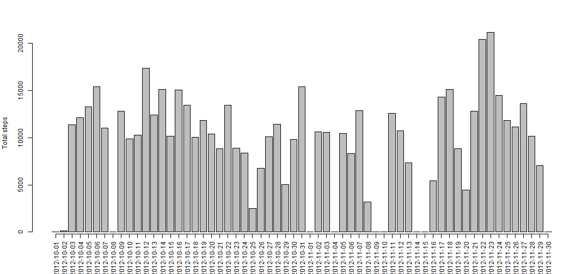
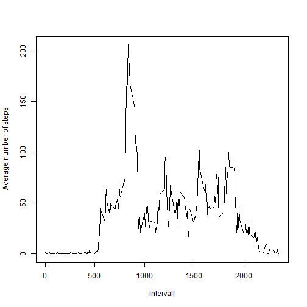
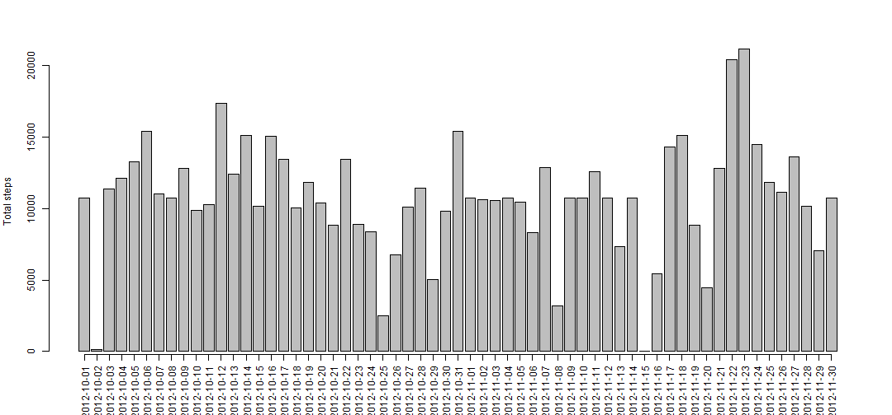
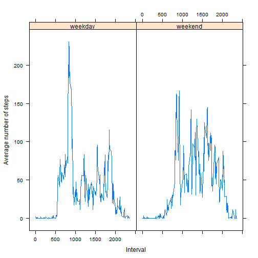

# Reproducible Research: Peer Assessment 1


## Loading and preprocessing the data

Reading in the activity data that shows the number of steps measured in 5 minute intervals
over 2 month. 
NA represents not exisitng data. The date format is the default YYYY-MM-DD. 


```r
activity <- read.csv("activity.csv")
activity$date <- as.Date(activity$date)

summary(activity)
```

```
##      steps            date               interval   
##  Min.   :  0.0   Min.   :2012-10-01   Min.   :   0  
##  1st Qu.:  0.0   1st Qu.:2012-10-16   1st Qu.: 589  
##  Median :  0.0   Median :2012-10-31   Median :1178  
##  Mean   : 37.4   Mean   :2012-10-31   Mean   :1178  
##  3rd Qu.: 12.0   3rd Qu.:2012-11-15   3rd Qu.:1766  
##  Max.   :806.0   Max.   :2012-11-30   Max.   :2355  
##  NA's   :2304
```

## What is mean total number of steps taken per day?

```r
library(plyr)
totalSteps <- ddply(activity, "date", summarise, total = sum(steps, na.rm = TRUE))
hist <- barplot(totalSteps$total, ylab = "Total steps", xaxt="n")
axis(1, at = hist, labels = totalSteps$date, las = 3)
```

 


```r
m <- mean(totalSteps$total, na.rm = TRUE)
med <- median(totalSteps$total, na.rm = TRUE)
```

The mean total number of steps per day is 9354.2295 and the median is 10395.

## What is the average daily activity pattern?


```r
intervalSteps <- ddply(activity, "interval", summarise, mean = mean(steps, na.rm = TRUE))

plot( intervalSteps$interval,
      intervalSteps$mean, 
      type = "l",
      ylab = "Average number of steps",
      xlab = "Intervall")
```

 


```r
maxInterval <- intervalSteps[which.max(intervalSteps$mean), "interval"]
```

The 835th interval is the inverval with the maximum number of steps on average.

## Imputing missing values

```r
numberRows <- nrow( activity[is.na(activity$steps), ] )
```
There are 2304 rows with missing values.

The following code tries to replace all NA values in the steps column with the steps mean, averaged over all days for the particular interval.
The summary of the new dataset shows that there are no NA values left in the new dataset.


```r
activityNoNA <- activity
activityNoNA$steps <- replace( activityNoNA$steps, 
                               is.na(activityNoNA$steps), 
                               intervalSteps[ intervalSteps$interval %in% activity[is.na(activity$steps),"interval"],"mean"])
summary(activityNoNA)
```

```
##      steps            date               interval   
##  Min.   :  0.0   Min.   :2012-10-01   Min.   :   0  
##  1st Qu.:  0.0   1st Qu.:2012-10-16   1st Qu.: 589  
##  Median :  0.0   Median :2012-10-31   Median :1178  
##  Mean   : 37.4   Mean   :2012-10-31   Mean   :1178  
##  3rd Qu.: 27.0   3rd Qu.:2012-11-15   3rd Qu.:1766  
##  Max.   :806.0   Max.   :2012-11-30   Max.   :2355
```


```r
totalStepsNoNA <- ddply(activityNoNA, "date", summarise, total = sum(steps))

histNoNA <- barplot(totalStepsNoNA$total, ylab = "Total steps", xaxt="n")
axis(1, at = histNoNA, labels = totalStepsNoNA$date, las = 3)
```

 


When NA values are replaced, the mean total number of steps per day is 1.0766 &times; 10<sup>4</sup> and the median is 1.0766 &times; 10<sup>4</sup>.
There is a difference of -1411.9592 to the mean of the NA containing data and a difference of -371.1887 to its median.


## Are there differences in activity patterns between weekdays and weekends?


```r
activityNoNA$day <- factor(ifelse(weekdays(activityNoNA$date) %in% c("Saturday", "Sunday"), "weekend", "weekday" ))

str(activityNoNA)
```

```
## 'data.frame':	17568 obs. of  4 variables:
##  $ steps   : num  1.717 0.3396 0.1321 0.1509 0.0755 ...
##  $ date    : Date, format: "2012-10-01" "2012-10-01" ...
##  $ interval: int  0 5 10 15 20 25 30 35 40 45 ...
##  $ day     : Factor w/ 2 levels "weekday","weekend": 1 1 1 1 1 1 1 1 1 1 ...
```

The differences in activity patterns are shown below:

```r
library(lattice)

dayIntervalSteps <- ddply( activityNoNA, 
                           c("interval", "day"),
                           summarise, 
                           mean = mean(steps, na.rm = TRUE))

xyplot( mean ~ interval | day,
        data = dayIntervalSteps,
        type = "l",
        ylab = "Average number of steps",
        xlab = "Interval")
```

 


